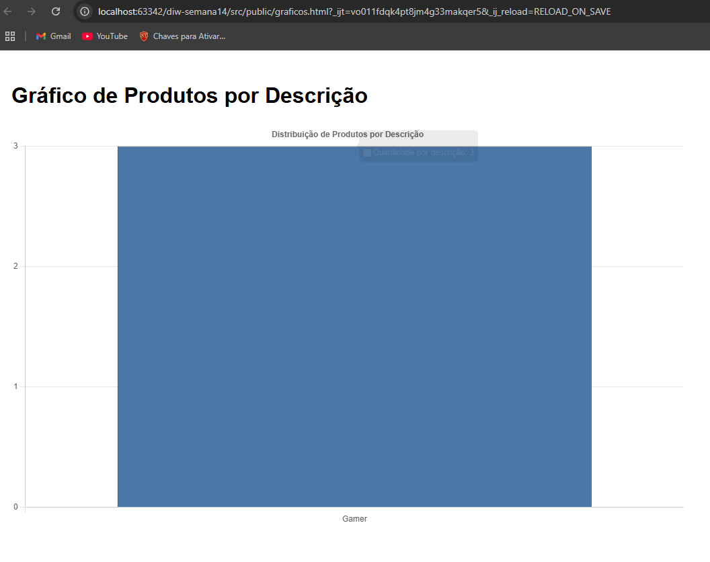

# Visualização de Produtos

### Flávio Henrique Lara Santos - 798019

## Projeto de Gerenciamento de Produtos
Este projeto é uma aplicação web desenvolvida com foco na gestão de produtos e visualização de dados utilizando HTML, CSS, JavaScript e a biblioteca Chart.js.

## Gráfico de Produtos por Descrição
O gráfico apresenta a quantidade de produtos agrupados por descrição, permitindo visualizar facilmente quais tipos de produtos foram mais cadastrados.

### Print 1 - Estado inicial

### Print 2 - Após novos produtos

## Dados que foram adicionados para gerar o segundo print

